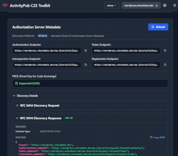

# ActivityPub Client-to-Server (C2S) Toolkit

A web-based development toolkit for testing and debugging ActivityPub servers that implement the Client-to-Server (C2S) protocol. 

> [!NOTE]
> This tool is designed for developers and server administrators to validate C2S implementations, not as an end-user client for social media activities (image sharing, microblogging, etc.). *It is still in early development.*


## Features

- 🌐 Fully browser-based
- 🔐 OAuth 2.0 authorization support with diagnostic features
- 🐘 Support for Mastodon legacy OAuth2 techniques
- 🔍 Actor discovery using multiple techniques
- 📡 Direct interaction with ActivityPub servers via C2S API
- 🔌 Supports NodeInfo and WebFinger APIs
- 📊 JSON browser for inspecting ActivityPub objects
- 🌙 Dark mode
- 🎨 Modern UI built with Vue 3 and Tailwind CSS
- 🚀 Fast development with Vite

## Screeenshots

[](docs/add-server.png)&nbsp;&nbsp;&nbsp;&nbsp;[](docs/oauth2-diagnostics.png)

[](docs/json-browser.png)&nbsp;&nbsp;&nbsp;&nbsp;[](docs/server-tables.png)


## Roadmap

- Advanced resource editors
- Support for more activity types
- Built-in tests, runner, and report generation.
- Add support for Protected Resource metadata and CIMD.

## Technologies

- **Frontend Framework**: Vue 3 with TypeScript
- **Build Tool**: Vite
- **Styling**: Tailwind CSS
- **Routing**: Vue Router
- **State Management**: Pinia (stores)
- **Code Quality**: ESLint

## Prerequisites

- Node.js (version 16 or higher recommended)
- npm or yarn package manager

## Installation

1. Clone the repository:
```bash
git clone https://github.com/steve-bate/activitypub-c2s-toolkit.git
cd activitypub-c2s-toolkit
```

2. Install dependencies:
```bash
npm install
```

## Development

Start the development server:

```bash
npm run dev
```

The application will be available at `http://localhost:5173` (or another port if 5173 is in use).

## Building

Create a production build:

```bash
npm run build
```

The built files will be in the `dist` directory.

## Preview Production Build

Preview the production build locally:

```bash
npm run preview
```

## Contributing

Contributions are welcome! Please feel free to submit a Pull Request.

1. Fork the repository
2. Create your feature branch (`git checkout -b feature/amazing-feature`)
3. Commit your changes (`git commit -m 'Add some amazing feature'`)
4. Push to the branch (`git push origin feature/amazing-feature`)
5. Open a Pull Request

## License

This project is licensed under the MIT License - see the [LICENSE](LICENSE) file for details.

## About ActivityPub C2S

This toolkit implements the [ActivityPub](https://www.w3.org/TR/activitypub/) Client-to-Server (C2S) protocol, enabling web clients to interact directly with ActivityPub servers for creating, reading, updating, and deleting social media content.

## Author

**Steve Bate**

## Acknowledgments

- [ActivityPub Specification](https://www.w3.org/TR/activitypub/)
- [W3C Social Web Working Group](https://www.w3.org/wiki/Socialwg)

---
