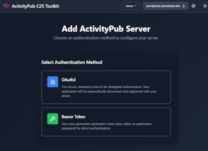
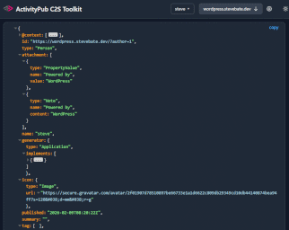
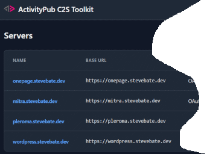

# ActivityPub Client-to-Server (C2S) Toolkit

A web-based development toolkit for testing and debugging ActivityPub servers that implement the Client-to-Server (C2S) protocol. 

> [!NOTE]
> This tool is designed for developers and server administrators to validate C2S implementations, not as an end-user client for social media activities (image sharing, microblogging, etc.). *It is still in active development.*


## Features

- Fully browser-based
- Direct interaction with ActivityPub servers via [C2S API](https://www.w3.org/TR/activitypub/#client-to-server-interactions)
- [OAuth 2.0](https://oauth.net/2/) authorization support with diagnostic features
- Support for [OAuth2 CIMD](https://client.dev/)
- Support for RFC9728  - [OAuth2 Protected Resource Metadata](https://datatracker.ietf.org/doc/rfc9728/)
- Supports RFC6750 [bearer tokens](https://datatracker.ietf.org/doc/html/rfc6750) (without an OAuth2 flow)
- Support for Mastodon [legacy OAuth2](https://docs.joinmastodon.org/spec/oauth/) implementation
- Authorized actor discovery using multiple methods
- ActivityPub object preview and actions
- Supports [NodeInfo](https://github.com/jhass/nodeinfo) and [WebFinger](https://datatracker.ietf.org/doc/html/rfc7033) APIs
- JSON browser for inspecting ActivityPub objects
- [Media Upload Support](#media-upload-support)
- [Embedded automated testing framework](docs/test-framework.md)
- [Server capability reports with test results](#server-capability-reports)
- [Server capabilities data export](#server-capabilities-data-export)
- [Resource Posting Tools](docs/resource-templates.md)
    - [Schema-driven ActivityPub resource editor](docs/resource-templates.md#form-based-template-editor)
    - [JSON template-based resource definition](docs/resource-templates.md#json-template-editor)
- Optional [sidecar server](docs/cors-sidecar.md) to help diagnose [CORS](https://developer.mozilla.org/en-US/docs/Web/HTTP/Guides/CORS) problems

## Media Upload Support

TODO - reference AP wiki page. Discuss issues with vague "spec"

## Server Capability Reports

A printable report describing capabilities and test results can be generated for a server. To generate a report, use the "Server Reports" option in the server menu.

## Server Capabilities Data Export

The servers table has an "Export JSON" button that can export many details about a C2S server (capabilities, test results, etc.). This can be useful for custom reporting like server comparison tables.

## Screenshots

[](docs/images/add-server.png)&nbsp;&nbsp;&nbsp;&nbsp;[](docs/images/oauth2-diagnostics.png)

[](docs/images/json-browser.png)&nbsp;&nbsp;&nbsp;&nbsp;[](docs/images/server-tables.png)


## Roadmap

- Pluggable AP object previews and actions
- Test creation from resource templates

## Installation

1. Clone the repository:
```bash
git clone https://github.com/steve-bate/activitypub-c2s-toolkit.git
cd activitypub-c2s-toolkit
```

2. Install dependencies:
```bash
npm install
```

3. Start the development server

```bash
npm run dev
```

## Development

### Technologies

- **Frontend Framework**: Vue 3 with TypeScript
- **Build Tool**: Vite
- **Styling**: Tailwind CSS
- **Routing**: Vue Router
- **State Management**: Pinia (stores)
- **Code Quality**: ESLint
- **Forms**: FormKit

### Prerequisites

- Node.js (version 16 or higher recommended)
- npm or yarn package manager

The application will be available at `http://localhost:5173` (or another port if 5173 is in use).

### Building

Create a production build:

```bash
npm run build
```

The built files will be in the `dist` directory.

### Preview Production Build

Preview the production build locally:

```bash
npm run preview
```

## License

This project is licensed under the MIT License - see the [LICENSE](LICENSE) file for details.

## References

### ActivityPub and Activity Streams

- [ActivityPub](https://www.w3.org/TR/activitypub/) - W3C Recommendation
- [Activity Streams 2.0](https://www.w3.org/TR/activitystreams-core/) - W3C Recommendation
- [Activity Vocabulary](https://www.w3.org/TR/activitystreams-vocabulary/) - W3C Recommendation
- [ActivityPub HTTP API Task Force](https://github.com/swicg/activitypub-http-api) - SWICG Repository

### OAuth 2.0 Specifications

- [RFC 6749](https://www.rfc-editor.org/rfc/rfc6749.html) - The OAuth 2.0 Authorization Framework
- [RFC 6750](https://www.rfc-editor.org/rfc/rfc6750.html) - OAuth 2.0 Bearer Token Usage
- [RFC 7591](https://www.rfc-editor.org/rfc/rfc7591.html) - OAuth 2.0 Dynamic Client Registration Protocol
- [RFC 7636](https://www.rfc-editor.org/rfc/rfc7636.html) - Proof Key for Code Exchange (PKCE)
- [RFC 8414](https://www.rfc-editor.org/rfc/rfc8414.html) - OAuth 2.0 Authorization Server Metadata
- [OAuth 2.0 Client-Initiated Metadata Document (CIMD)](https://datatracker.ietf.org/doc/html/draft-ietf-oauth-client-id-metadata-document) - IETF Draft
- [OAuth 2.0 Protected Resource Metadata](https://www.ietf.org/archive/id/draft-ietf-oauth-resource-metadata-09.html) - IETF Draft
- [IndieAuth](https://indieauth.spec.indieweb.org/) - IndieWeb OAuth 2.0 extension (defines `me` parameter)


