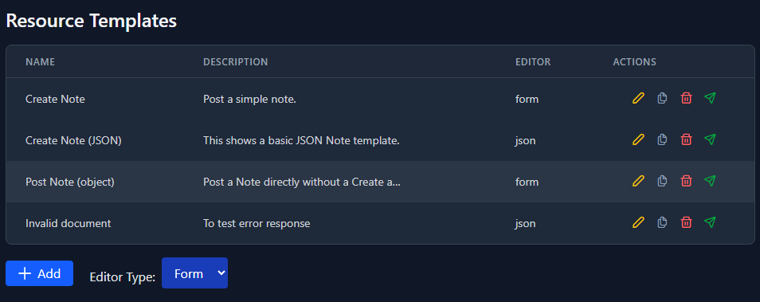
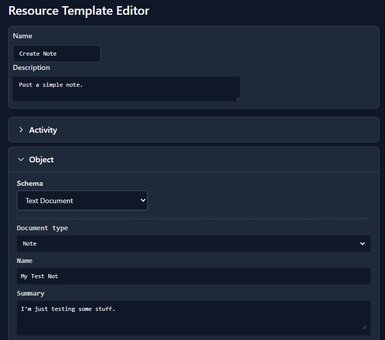
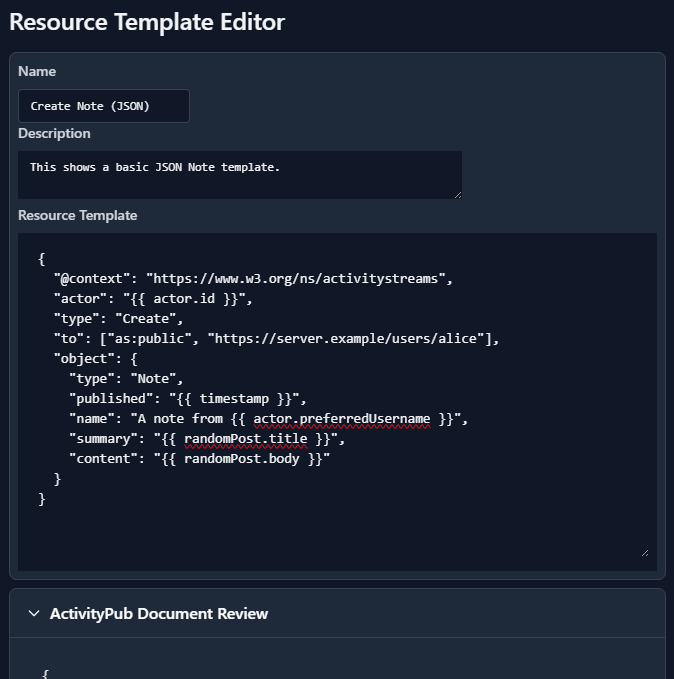

# Posting Resources

The toolkit supports posting custom ActivityPub documents to servers to test C2S functionality. The posted documents can be created using either an extensible schema-based form or by creating a JSON template. The forms are useful for easily creating well-sructured documents. The JSON templates also allow creating malformed documents to test a server's ability to handle invalid data.

## Template Management

The resource templates are shown in a table that provide basic management capabilities.

* Add - create a new template that will use either the form-based or JSON editors.
* Edit - edit a template using the editor associated with it.
* Duplicate - duplicates a template
* Delete - removes a template
* Post - posts the document generated from the template to the actor's outbox

A resource template can be used to send test payloads to ActivityPub C2S servers. 

There are two kinds of template editors:

* Schema-driven form-based editor
* JSON editor

## Form-based Template Editor

The form-based editor uses [FormKit](https://formkit.com) with extensions for postprocessing values for ActivityPub compatibility.

### Value Transformations

| Transform | Description |
|---|---|
| `split` | Splits text into an array |
| `datetime-utc` | Formats a timestamp to be AS2-compatible (using UTC time zone) |
| `template`` | Transform a value based on a [HandleBars](https://handlebarsjs.com/) template | 

Multiple transformations can be applied to a value. For example, a `tags` string can be split on newlines and then provided to a template processor to create ActivityPub `HashTag` objects.

### Document Post Processing

Currently automatic. Will add `actor` to activity (if missing) and add `attributedTo` to activity object (if missing).

## JSON Template Editor

This can be used when a custom or complex payload is needed. It can also define documenst that are invalid JSON or ActivityPub data.

The JSON template is [Handlebars](https://handlebarsjs.com/) template. A template context is provided to support dynamically-defined documents.

| Name         | Description                                                                                                                                                                  |
| ------------ | ---------------------------------------------------------------------------------------------------------------------------------------------------------------------------- |
| `actor`      | The AP document for the actor.                                                                                                                                               |
| `baseUrl`    | Gets the base url of the value. Example: `{{ baseurl actor.id }}`                                                                                                            |
| `randomPost` | Provides values that can be used to populate content. Examples: `{{ randomPost.title }}`, `{{ randomPost.body }}`. This uses the INSERT_URL API to retrieve the random post. |

## Future Work

* Ability to create server tests based on a resource template.
* Create a DSL to externalize form schemas to make it easier to define new ones.
* Extend the sidecar server to support persisting schemas and templates rather than storing them in browser storage.