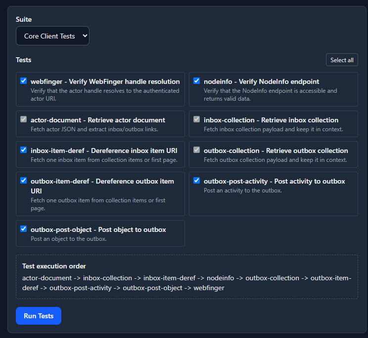
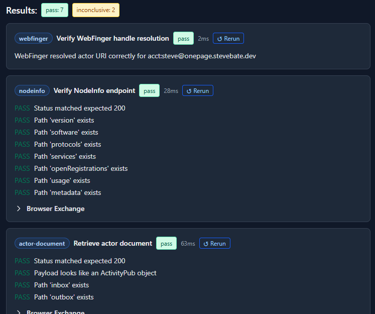

# Server Test Framework

The toolkit provides an embedded, extensible test framework for testing C2S server behaviors.

There is a built-in core suite of C2S tests for webfinger actor URI resolution, retrieving actor documents, retrieving the inbox and outbox (and contained items), and posting to the outbox.

# Running Tests

For each test suite, specific tests can be selected or unselected (skipped). This allows tests for functionality that is not supported by a given server to be skipped.

The tests may have dependencies on the results of other tests. If a test is a dependency for a selected test, it cannot be unselected until the dependent test is unselected.

The tests are run in a dependency-based ordering. The tool provides a preview of the test execution order.

# Test Results

The test results show the status of the test execution and the test response assertions. It also provides a button for rerunning a specific test. This can be useful for interactive debugging and development purposes.

A test result may also include details about the HTTP request and response to help with diagnosing causes of test failures.

## Defining Tests

TBD (see source code for now)

## Future Work

* Create simple tests either interactively or using JSON templates
    * Send a template-based document
    * Add response assertions
        * Expect status code (could be OK, error, etc.)
        * Expect header, optionally with value pattern
        * Expect JSON property values (patterns, dotted-notation).
        * Expect Text response pattern
* Create a JSON-based test DSL